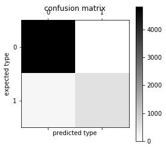

# Spam or Ham
Using Machine Learning to create a model to detect spam text messages


```python
# Import Dependencies
%matplotlib inline
import matplotlib.pyplot as plt
import csv
from textblob import TextBlob
import pandas as pd
import sklearn
from sklearn.externals import joblib
import _pickle as pickle
import numpy as np
from sklearn.feature_extraction.text import CountVectorizer, TfidfTransformer
from sklearn.naive_bayes import MultinomialNB
from sklearn.svm import SVC, LinearSVC
from sklearn.metrics import classification_report, f1_score, accuracy_score, confusion_matrix
from sklearn.pipeline import Pipeline
from sklearn.grid_search import GridSearchCV
from sklearn.cross_validation import StratifiedKFold, cross_val_score, train_test_split 
from sklearn.tree import DecisionTreeClassifier 
from sklearn.learning_curve import learning_curve
```


```python
# Import CSV with training data and preview
messages = pd.read_csv('data/sms.csv')
messages.head()
```


<div>
<style>
    .dataframe thead tr:only-child th {
        text-align: right;
    }

    .dataframe thead th {
        text-align: left;
    }

    .dataframe tbody tr th {
        vertical-align: top;
    }
</style>
<table border="1" class="dataframe">
  <thead>
    <tr style="text-align: right;">
      <th></th>
      <th>type</th>
      <th>sms</th>
    </tr>
  </thead>
  <tbody>
    <tr>
      <th>0</th>
      <td>ham</td>
      <td>Go until jurong point, crazy.. Available only ...</td>
    </tr>
    <tr>
      <th>1</th>
      <td>ham</td>
      <td>Ok lar... Joking wif u oni...</td>
    </tr>
    <tr>
      <th>2</th>
      <td>spam</td>
      <td>Free entry in 2 a wkly comp to win FA Cup fina...</td>
    </tr>
    <tr>
      <th>3</th>
      <td>ham</td>
      <td>U dun say so early hor... U c already then say...</td>
    </tr>
    <tr>
      <th>4</th>
      <td>ham</td>
      <td>Nah I don't think he goes to usf, he lives aro...</td>
    </tr>
  </tbody>
</table>
</div>


# Creating the model with Naive Bayes classifier for multinomial models


```python
def split_into_tokens(sms):
    return TextBlob(sms).words
```


```python
messages.sms.head().apply(split_into_tokens)
```


    0    [Go, until, jurong, point, crazy, Available, o...
    1                       [Ok, lar, Joking, wif, u, oni]
    2    [Free, entry, in, 2, a, wkly, comp, to, win, F...
    3    [U, dun, say, so, early, hor, U, c, already, t...
    4    [Nah, I, do, n't, think, he, goes, to, usf, he...
    Name: sms, dtype: object


```python
def split_into_lemmas(message):
    message = message.lower()
    words = TextBlob(message).words
    # for each word, take its "base form" = lemma 
    return [word.lemma for word in words]

messages.sms.head().apply(split_into_lemmas)
```


    0    [go, until, jurong, point, crazy, available, o...
    1                       [ok, lar, joking, wif, u, oni]
    2    [free, entry, in, 2, a, wkly, comp, to, win, f...
    3    [u, dun, say, so, early, hor, u, c, already, t...
    4    [nah, i, do, n't, think, he, go, to, usf, he, ...
    Name: sms, dtype: object


```python
bow_transformer = CountVectorizer(analyzer=split_into_lemmas).fit(messages['sms'])
print (len(bow_transformer.vocabulary_))
```

    8859


```python
messages_bow = bow_transformer.transform(messages['sms'])
print ('sparse matrix shape:', messages_bow.shape)
print ('number of non-zeros:', messages_bow.nnz)
print ('sparsity: %.2f%%' % (100.0 * messages_bow.nnz / (messages_bow.shape[0] * messages_bow.shape[1])))
```

    sparse matrix shape: (5572, 8859)
    number of non-zeros: 80337
    sparsity: 0.16%


```python
tfidf_transformer = TfidfTransformer().fit(messages_bow)
tfidf4 = tfidf_transformer.transform(messages_bow)
print (tfidf4)
```

      (0, 8548)	0.213191915195
      (0, 8334)	0.1787434255
      (0, 8090)	0.224064290433
      (0, 7693)	0.152159406576
      (0, 6021)	0.217151834996
      (0, 5654)	0.153186475358
      (0, 5315)	0.170798938903
      (0, 4597)	0.268665886822
      (0, 4450)	0.318021545573
      (0, 4179)	0.104754468437
      (0, 3710)	0.176668901917
      (0, 3673)	0.147426442039
      (0, 3628)	0.140959953795
      (0, 2908)	0.188514085819
      (0, 2418)	0.24628579544
      (0, 2156)	0.268665886822
      (0, 1849)	0.268665886822
      (0, 1847)	0.303585940789
      (0, 1411)	0.241829664372
      (0, 1189)	0.318021545573
      (1, 8456)	0.423368986158
      (1, 8002)	0.190642410794
      (1, 5650)	0.536162938383
      (1, 5618)	0.269609911825
      (1, 4631)	0.400511255235
      :	:
      (5570, 5417)	0.206945648796
      (5570, 4722)	0.156816833215
      (5570, 4310)	0.112587330264
      (5570, 4252)	0.283175964011
      (5570, 4179)	0.110412036061
      (5570, 4098)	0.150659813931
      (5570, 3858)	0.16983330494
      (5570, 3766)	0.205735046962
      (5570, 3547)	0.271225859626
      (5570, 3433)	0.157634412446
      (5570, 3382)	0.119688712439
      (5570, 2987)	0.240418234102
      (5570, 2686)	0.171709966093
      (5570, 1882)	0.27875610821
      (5570, 1875)	0.135084799416
      (5570, 1652)	0.335197217665
      (5570, 1549)	0.141066270378
      (5570, 1203)	0.110742242864
      (5570, 1016)	0.319981976351
      (5570, 4)	0.23616552959
      (5571, 7939)	0.471514362912
      (5571, 7801)	0.162536381051
      (5571, 6595)	0.610119596469
      (5571, 5334)	0.426114539305
      (5571, 4310)	0.444338393344


```python
messages_tfidf = tfidf_transformer.transform(messages_bow)
print (messages_tfidf.shape)
```

    (5572, 8859)


```python
%time spam_detector = MultinomialNB().fit(messages_tfidf, messages['type'])
```

    CPU times: user 20.5 ms, sys: 2.37 ms, total: 22.9 ms
    Wall time: 22 ms


```python
# Test Model
print ('predicted:', spam_detector.predict(tfidf4)[0])
print ('expected:', messages.type[3])
```

    predicted: ham
    expected: ham


```python
all_predictions = spam_detector.predict(messages_tfidf)
print (all_predictions)
```

    ['ham' 'ham' 'spam' ..., 'ham' 'ham' 'ham']


```python
print ('accuracy', accuracy_score(messages['type'], all_predictions))
print ('confusion matrix\n', confusion_matrix(messages['type'], all_predictions))
print ('(row=expected, col=predicted)')
```

    accuracy 0.969490308686
    confusion matrix
     [[4825    0]
     [ 170  577]]
    (row=expected, col=predicted)


```python
plt.matshow(confusion_matrix(messages['type'], all_predictions), cmap=plt.cm.binary, interpolation='nearest')
plt.title('confusion matrix')
plt.colorbar()
plt.ylabel('expected type')
plt.xlabel('predicted type')
```


    Text(0.5,0,'predicted type')





```python
print (classification_report(messages['type'], all_predictions))
```

                 precision    recall  f1-score   support
    
            ham       0.97      1.00      0.98      4825
           spam       1.00      0.77      0.87       747
    
    avg / total       0.97      0.97      0.97      5572
    


# Creating a model with a Support Vector Machine


```python
msg_train, msg_test, label_train, label_test = \
    train_test_split(messages['sms'], messages['type'], test_size=0.2)

print (len(msg_train), len(msg_test), len(msg_train) + len(msg_test))
```

    4457 1115 5572


```python
pipeline_svm = Pipeline([
    ('bow', CountVectorizer(analyzer=split_into_lemmas)),
    ('tfidf', TfidfTransformer()),
    ('classifier', SVC()),  # <== change here
])

# Pipeline parameters to automatically explore and tune
param_svm = [
  {'classifier__C': [1, 10, 100, 1000], 'classifier__kernel': ['linear']},
  {'classifier__C': [1, 10, 100, 1000], 'classifier__gamma': [0.001, 0.0001], 'classifier__kernel': ['rbf']},
]

grid_svm = GridSearchCV(
    pipeline_svm,  # Pipeline from above
    param_grid=param_svm,  # Parameters to tune via cross validation
    refit=True,  # Fit using all data, on the best detected classifier
    n_jobs=-1,  # Number of cores to use for parallelization; -1 for "all cores"
    scoring='accuracy',  # what score are we optimizing?
    cv=StratifiedKFold(label_train, n_folds=5),  # What type of cross validation to use
)
```


```python
%time svm_detector = grid_svm.fit(msg_train, label_train) # Find the best combination from param_svm
print (svm_detector.grid_scores_)
```

    CPU times: user 4.04 s, sys: 148 ms, total: 4.19 s
    Wall time: 1min 50s
    [mean: 0.98676, std: 0.00372, params: {'classifier__C': 1, 'classifier__kernel': 'linear'}, mean: 0.98676, std: 0.00229, params: {'classifier__C': 10, 'classifier__kernel': 'linear'}, mean: 0.98676, std: 0.00229, params: {'classifier__C': 100, 'classifier__kernel': 'linear'}, mean: 0.98676, std: 0.00229, params: {'classifier__C': 1000, 'classifier__kernel': 'linear'}, mean: 0.87099, std: 0.00007, params: {'classifier__C': 1, 'classifier__gamma': 0.001, 'classifier__kernel': 'rbf'}, mean: 0.87099, std: 0.00007, params: {'classifier__C': 1, 'classifier__gamma': 0.0001, 'classifier__kernel': 'rbf'}, mean: 0.87099, std: 0.00007, params: {'classifier__C': 10, 'classifier__gamma': 0.001, 'classifier__kernel': 'rbf'}, mean: 0.87099, std: 0.00007, params: {'classifier__C': 10, 'classifier__gamma': 0.0001, 'classifier__kernel': 'rbf'}, mean: 0.97061, std: 0.00711, params: {'classifier__C': 100, 'classifier__gamma': 0.001, 'classifier__kernel': 'rbf'}, mean: 0.87099, std: 0.00007, params: {'classifier__C': 100, 'classifier__gamma': 0.0001, 'classifier__kernel': 'rbf'}, mean: 0.98788, std: 0.00260, params: {'classifier__C': 1000, 'classifier__gamma': 0.001, 'classifier__kernel': 'rbf'}, mean: 0.97061, std: 0.00711, params: {'classifier__C': 1000, 'classifier__gamma': 0.0001, 'classifier__kernel': 'rbf'}]


```python
print (confusion_matrix(label_test, svm_detector.predict(msg_test)))
print (classification_report(label_test, svm_detector.predict(msg_test)))
```

    [[942   1]
     [ 15 157]]
                 precision    recall  f1-score   support
    
            ham       0.98      1.00      0.99       943
           spam       0.99      0.91      0.95       172
    
    avg / total       0.99      0.99      0.99      1115
    


```python
pickle.dump(svm_detector, open('sms_spam_detector.pkl', 'wb'))
```


```python
spam_detect = pickle.load(open('sms_spam_detector.pkl', 'rb'))
```


```python
print(msg_test)
```

    1988                     No calls..messages..missed calls
    1444    Free 1st week entry 2 TEXTPOD 4 a chance 2 win...
    3602                         Jay told me already, will do
    2272    Life spend with someone for a lifetime may be ...
    5162                 Just send a text. We'll skype later.
    3593                                    I anything lor...
    4945    Wrong phone! This phone! I answer this one but...
    1154    1000's of girls many local 2 u who r virgins 2...
    2005    Goodmorning, today i am late for  &lt;DECIMAL&...
    3124    He telling not to tell any one. If so treat fo...
    3655                     Why i come in between you people
    3231    I feel like a dick because I keep sleeping thr...
    3904    Waiting in e car 4 my mum lor. U leh? Reach ho...
    5248               U come n search tat vid..not finishd..
    2702    Hiya, sorry didn't hav signal. I haven't seen ...
    1044    Mmm thats better now i got a roast down me! i’...
    5534                         Ok which your another number
    5250    Urgent! Please call 09061213237 from a landlin...
    5569    Pity, * was in mood for that. So...any other s...
    3185    Good morning pookie pie! Lol hope I didn't wak...
    4172    Pls what's the full name of joke's school cos ...
    3575                        Yeah sure I'll leave in a min
    4198    FREE for 1st week! No1 Nokia tone 4 ur mob eve...
    1476    Nice. Wait...should you be texting right now? ...
    5232    YOU ARE CHOSEN TO RECEIVE A £350 AWARD! Pls ca...
    4585    Noooooooo please. Last thing I need is stress....
    4651    Finally it has happened..! Aftr decades..! BEE...
    3573                 Yup, leaving right now, be back soon
    1225    You are a winner U have been specially selecte...
    1899                      Wat would u like 4 ur birthday?
                                  ...                        
    4962    A bit of Ur smile is my hppnss, a drop of Ur t...
    1457    U sleeping now.. Or you going to take? Haha.. ...
    1260    We have sent JD for Customer Service cum Accou...
    4890    Japanese Proverb: If one Can do it, U too Can ...
    1800         If we hit it off, you can move in with me :)
    3929       Babe ? I lost you ... Will you try rebooting ?
    3742                                        2/2 146tf150p
    2404    Jesus christ bitch I'm trying to give you drug...
    1619    The 2 oz guy is being kinda flaky but one frie...
    2468    Is there coming friday is leave for pongal?do ...
    666     En chikku nange bakra msg kalstiya..then had t...
    3458    Friendship poem: Dear O Dear U R Not Near But ...
    2885    Cbe is really good nowadays:)lot of shop and s...
    3749    A bit of Ur smile is my hppnss, a drop of Ur t...
    4241    The LAY MAN! Just to let you know you are miss...
    5096    But i'm really really broke oh. No amount is t...
    3488                        Change windows logoff sound..
    5356                       Tell me something. Thats okay.
    1036    Hello baby, did you get back to your mom's ? A...
    1321    Just sent again. Do you scream and moan in bed...
    3574    You won't believe it but it's true. It's Incre...
    5543               U still havent got urself a jacket ah?
    197                          Did u got that persons story
    5519    Can you pls send me that company name. In saib...
    520     Usually the person is unconscious that's in ch...
    3235                                  Yup ü not comin :-(
    4286                         I pocked you up there before
    1536    You have won a Nokia 7250i. This is what you g...
    3297    Hi there. We have now moved in2 our pub . Woul...
    3056    EASTENDERS TV Quiz. What FLOWER does DOT compa...
    Name: sms, Length: 1115, dtype: object

